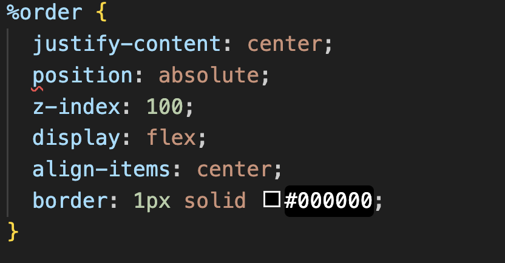
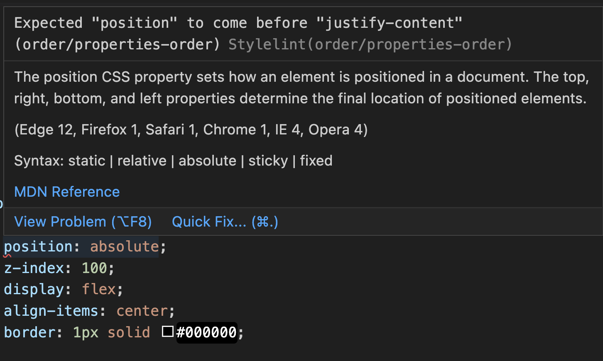

# Stylelint 的導入和設定

之前參與的專案中，曾經遇到 CSS 是靠人工的方式進行規範，

在案子規模逐漸擴大和協作人員增加之後，CSS 變得越來越難維護 ...

所以在進行研究後，跟專案人員進行了 Stylelint 的相關知識科普，並將其導入專案內使用

文章分成以下段落：

* 為何要使用 Stylelint
* 安裝
* 規範和實例
* 小結
* 參考資料


## 為什麼要用 Stylelint

我們到底需要一個新的工具來解決怎樣的問題？

曾經在開發的過程中產生以下的困惑：

* 從 CSS class name 看不懂是給什麼元件 / 狀態使用
* 為什麼 build 出來一包 CSS 會那麼肥？
* 這邊複寫不下去了只能加 `!important`
* 這個屬性到底是從哪個 class 開始被覆寫的？

因為對於開發實在有些困擾，研究後想嘗試使用 Stylelint，
透過自動檢查 CSS 是否符合相關規範，來解決上述之困擾，

而在選用一個新工具之前，建議可以先釐清要處理的議題有哪些，比較不會陷入 "因為用而用" 的盲點。


## 安裝

在原本的 npm 專案下執行指令即可安裝，相關設定可以直接參考官網步驟教學，

根據團隊的規範和自己的習慣，來選擇適合的套件進行安裝，

另外我也會在自己習慣的 IDE 安裝相關套件，以便後續動作：

``` shell
> npm install --save-dev stylelint stylelint-config-standard stylelint-config-standard-scss
```

- [官方步驟教學](https://stylelint.io/user-guide/get-started/)
- [VS code extension](https://marketplace.visualstudio.com/items?itemName=stylelint.vscode-stylelint)


## 規範和實例

從零開始打造一份良好的 CSS 規範實在有點辛苦，

最省力的作法往往還是站在巨人的肩膀上繼續前行，

以下列出幾個常會拿來引用的規範，可以拿一個跟自己開發習慣最相近的規範來使用，

再針對細節進行客製化設定和調整：

- The Idiomatic CSS Principles
  - [EN](https://github.com/necolas/idiomatic-css)
  - [TW](https://github.com/necolas/idiomatic-css/tree/master/translations/zh-TW)
- Airbnb's Styleguide
  - [EN](https://github.com/airbnb/css#css)
  - [TW](https://github.com/ArvinH/css-style-guide)
- [Google's CSS Style Guide](https://google.github.io/styleguide/htmlcssguide.html#CSS_Formatting_Rules)
- [@mdo's Code Guide.](https://codeguide.co/#css)


以下幾個規則是我在開發的時候，實際遇到覺得透過工具規範後有幫助的，

除了下方項目外，當然還有非常多規則可以制定，從大小寫、縮排、空格到換行等

有的可以遵循邏輯進行推敲，有的是寫作風格和習慣，

制定規則時，也要記得使用這個工具是為了開發可以更順利，

別到最後，變成為了強制符合規範卻被綁手綁腳導致開發不順。

1. [Class names](#class-names)
2. [Declaration order](#declaration-order)
3. [Nested selectors](#nested-selectors)
4. [Color](#color)


### Class names

為了在開發時能更直覺理解 CSS 樣式應該要如何套用在相對應的元件 / 狀態，

約定好命名規則搭配 CSS 設計模式，可以減少不知道該如何命名 CSS 樣式的困擾。

- kebab-case: ^([a-z][a-z0-9]*)(-[a-z0-9]+)*$
- lowerCamelCase: ^[a-z][a-zA-Z0-9]+$
- snake_case: ^([a-z][a-z0-9]*)(_[a-z0-9]+)*$
- UpperCamelCase: ^[A-Z][a-zA-Z0-9]+$
- 可基於 BEM, OOCSS, SMACSS 進行調整


### Declaration order

越是複雜的 CSS 越容易疊加大量的樣式，若是沒有遵循一定的樣式排序，

就很容易發生同一個 CSS class 內，前面已經定義過的樣式，後面又不小心複寫一次，

然後 CSS 就會像裹腳布一樣越來越長越來越臭 :(

在 Stylelint 內設定樣式排序後，若你的排序有錯它會提醒，排序的邏輯大致是由外到內，由大到小：

- Positioning
- Box model
- Typographic
- Visual
- Misc

以下是一個沒有遵守排序規範的 CSS，在 VS Code 內會出現紅線的提示：



把滑鼠移上去，就會出現提示，根據提示進行修改或自行設定 autofix：




### Nested selectors

CSS 巢狀結構寫的太深，會造成耦合性太高而難以重複使用，

一般來說，建議不要超過 3 / 5 層，此規則建議也是需要根據專案內使用的 CSS 設計模式相互搭配。

```css
  .page-container {
    .content {
      .profile {
        ...
      }
    }
  }
```

通常巢狀成這樣的時候，不僅難以複用，也常會因為需求更動導致 CSS 壞掉，

寫之前需要好好先思考一下 ：）

```css
  .page-container > .content > .profile span:first-child {
    ...
  }
```

### Color

色碼的寫法也有很多種，對於字母大小寫或小數點的寫法，也可以進行規範：

```css
#ff0
#Ff0
#ffff00
#FFFF00
```

```css
rgba(0, 0, 0, 0.5)
rgba(0, 0, 0, .5)
```

## 小結

- 設定可遵照主流、可客製化、可例外。但太多例外等於沒有例外，要小心處理
- 事在人為，工具只是輔助，協作者若開發習慣不好，依然會導致問題
- 透過自動化檢查的機制，可朝向易閱讀利於協作、減少錯誤發生的機會和最佳化 CSS 檔案的目標前進


## 參考資料

- [為什麼要使用 stylelint](https://css-tricks.com/stylelint/)
- [Stylelint plugins list](https://github.com/stylelint/awesome-stylelint)
- [Stylelint rules](https://stylelint.io/user-guide/rules/list/)

若想要了解其他人對於 CSS 的應用和新趨勢，推薦可以逛：

- [State of CSS 2022](https://2022.stateofcss.com/en-US/)
- [State of CSS 2022 from Google](https://web.dev/state-of-css-2022/)
- [How browsers work from Google](https://web.dev/howbrowserswork/)

